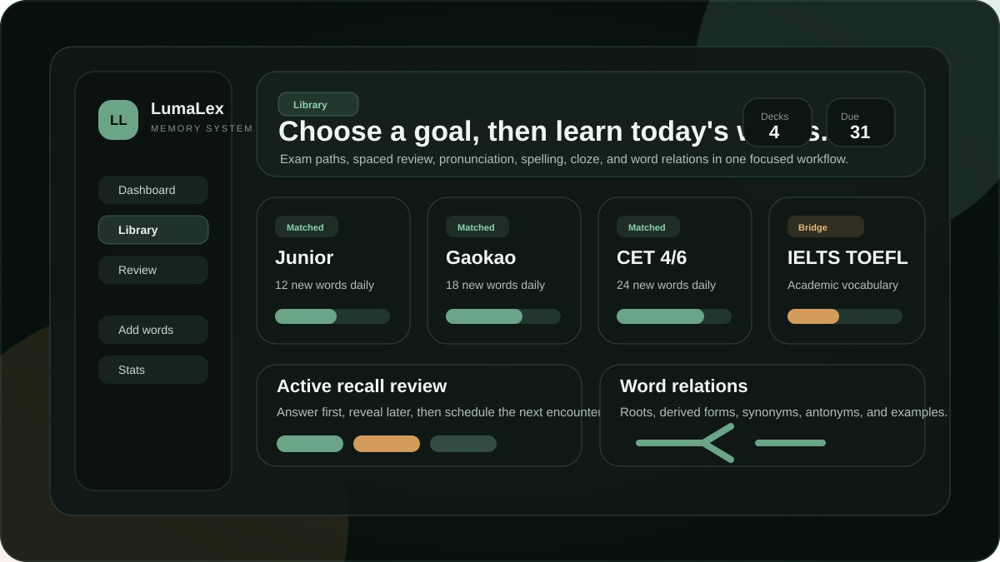

# LumaLex

LumaLex is a memory-first English vocabulary app for Chinese learners who need words to stay remembered, not just collected.

It is built for middle school students, high school students, university students, CET learners, and IELTS or TOEFL learners who want a focused daily workflow: add words, learn them with active recall, review them at the right time, and practice spelling, listening, cloze, examples, and word relations on mobile or desktop.

[Live demo](https://worldapp-livid.vercel.app/library) | [Roadmap](#roadmap) | [Contributing](#contributing)

The demo now includes a local trial mode, so visitors can explore the study flow before creating an account.



## Why Star This Project

- It is a real vocabulary learning product, not a static word-list demo.
- It combines active recall, spaced review, pronunciation, spelling, sentence cloze, and word relations in one workflow.
- It is shaped around exam learners in China, including junior high, senior high, CET-4, CET-6, IELTS, and TOEFL paths.
- It is local-first with IndexedDB, then syncs learning data through Vercel serverless APIs and Neon Postgres.
- The project is small enough to understand, but serious enough for meaningful frontend, product, data, and learning-science contributions.

If LumaLex helps your English study or gives you ideas for learning-tool design, a GitHub star helps more students and contributors find it.

## Who It Helps

| Learner | What LumaLex should help with |
| --- | --- |
| Middle school students | Build basic word recognition, pronunciation, and spelling confidence. |
| High school students | Prepare for reading, cloze, writing, and high-frequency exam vocabulary. |
| University students | Work through CET-4 and CET-6 vocabulary without last-minute cramming. |
| IELTS and TOEFL learners | Build an academic vocabulary base and practice recall from examples and sound. |
| Self-directed readers | Turn unfamiliar words from sentences into reviewable memory items. |

## Product Highlights

- **Exam path library:** guided library entry points for junior high, senior high, CET, and IELTS/TOEFL bridge study.
- **Five review modes:** English to Chinese, Chinese to English, listening comprehension, spelling review, and sentence cloze.
- **Memory scheduling:** review results update strength, wrong counts, focus status, and next review time.
- **Cross-device account sync:** vocabulary, learning history, review progress, settings, and active sessions can follow the same account.
- **Offline-friendly dictionary:** fast local lookup backed by a sharded built-in dictionary, plus optional AI completion.
- **AI relation-word explorer:** fetches lookalikes, synonyms, antonyms, and derived expressions inside study detail views.
- **Pronunciation workflow:** switch between US and UK accents and replay from the phonetic area.
- **Example-based learning:** clickable words inside example sentences can be quickly added to a deck.
- **Word relations panel:** derived forms, roots, collocations, synonyms, antonyms, and recall helpers during study.
- **Mobile-focused UI:** compact review cards, bottom navigation, and large touch targets for phone use.

## Study Workflow

1. Choose a goal in the library, such as high school, CET-4, CET-6, or IELTS/TOEFL bridge.
2. Learn a small set of words with active recall before seeing the full answer.
3. Review due words through meaning recall, audio recall, spelling, or cloze.
4. Mark weak words and let the scheduler bring them back sooner.
5. Use examples and word relations to move beyond isolated translation.

## Review Modes

| Mode | What the learner does |
| --- | --- |
| English to Chinese | See the English word and recall the Chinese meaning. |
| Chinese to English | See the Chinese meaning and recall the English word. |
| Listening comprehension | Hear the word first, then recall its meaning before revealing the answer. |
| Spelling review | Type the English word from its Chinese meaning. |
| Sentence cloze | Fill the missing word inside an example sentence. |

## Built-In Word Material

The repository includes seed pipelines and system lexicon data for guided study:

- CET-4 high-frequency vocabulary
- CET-4 translation phrases
- CET-6 high-frequency vocabulary
- Daily-life beginner vocabulary and phrases
- Custom decks for personal reading, school material, mistakes, and exam themes

Future public lexicon priorities are high school vocabulary, IELTS academic reading, TOEFL listening scenes, and synonym-substitution packs.

## Tech Stack

- Frontend: React, TypeScript, Vite, Tailwind CSS, Zustand, Dexie
- API: Vercel serverless functions
- Database: Neon Postgres
- Optional local backend: Flask for legacy and local data workflows

## Project Structure

```text
api/                 Vercel serverless API routes
backend/             Optional Flask backend and system lexicon tools
frontend/            React + Vite application
scripts/             Data seeding and maintenance scripts
docs/                Product notes, weekly updates, and public assets
vercel.json          Vercel deployment configuration
```

See [docs/architecture.md](docs/architecture.md) for the supported runtime boundaries, authentication model, and sync data flow. The root static files are a Flask fallback for the legacy client; production product work lives in `frontend/src`.

## Getting Started

Use Node.js 20.19+ and Python 3.12+ for the supported development environment.

Install root API dependencies:

```bash
npm ci
```

Install and run the frontend:

```bash
cd frontend
npm ci
npm run dev
```

On Windows PowerShell, `npm` may be blocked by execution policy. Use `npm.cmd` instead:

```bash
cd frontend
npm.cmd run build
```

## Development Checks

The repository includes Node security/unit tests, Flask integration tests, API syntax validation, standalone TypeScript checking, and a production frontend build. GitHub Actions runs the same checks on pushes and pull requests to `main`.

Current local checks:

```bash
npm ci
cd frontend
npm ci
cd ..
npm run check
```

Focused commands:

```bash
npm run check:api
npm test
npm --prefix frontend run typecheck
npm --prefix frontend run build
```

Before calling a change live, use `docs/release-checklist.md` to verify local build health, desktop behavior, mobile behavior, and deployed Vercel content.

## Environment

Create local environment files from your own credentials. Do not commit real secrets.

Common server variables:

```env
DATABASE_URL=postgresql://...
POSTGRES_URL=postgresql://...
CORS_ALLOWED_ORIGINS=https://separate-frontend.example
```

Leave `CORS_ALLOWED_ORIGINS` empty for the recommended same-origin deployment. Passwords use salted scrypt hashes, sync sessions are random and revocable, and existing legacy local accounts are upgraded after password login.

Frontend development can point to a deployed API:

```env
VITE_API_BASE=https://your-domain.example/api
```

## Deployment

The repository is configured for Vercel:

- root install: `npm ci && cd frontend && npm ci`
- build command: `cd frontend && npm run build`
- output directory: `frontend/dist`

Set database credentials in the hosting provider environment variable panel before deploying.

## Roadmap

- Add dedicated high school, IELTS, and TOEFL public lexicons.
- Add browser automation for complete learn, review, spelling, and cloud-conflict flows.
- Add review scheduling and dictionary schema unit coverage.
- Add shareable study progress cards for social and class group sharing.
- Improve README screenshots with real deployed-product captures after the next stable release.
- Publish a student-facing changelog so users can see visible weekly progress.

## Contributing

Focused pull requests are welcome. The most useful contributions are small improvements that make LumaLex easier to understand, try, trust, share, or study with.

Good first contribution areas:

- Review UX polish for mobile study sessions
- New public exam word packs with clean source notes
- Dictionary and word-relation quality improvements
- Sync reliability and clearer sync status
- README screenshots, demo scripts, and student-facing docs
- Build, test, and lint coverage

Please use the issue templates for reproducible bugs or focused feature requests, and the PR template to list the product goal, checks run, risks, and rollback path.

## Safety Notes

This public repository intentionally excludes:

- `.env*` files with database credentials or tokens
- Vercel local metadata
- `node_modules`
- build outputs
- local databases and logs
- PDF vocabulary source files

## License

MIT
