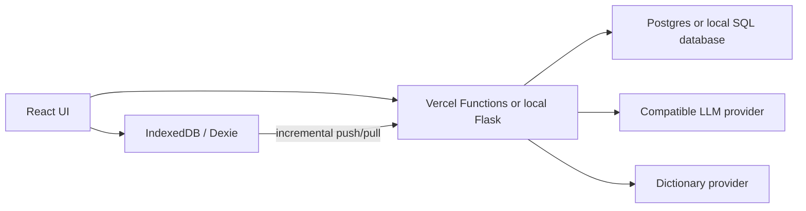

# LumaLex architecture

## Runtime boundaries

The production deployment has one supported entry point: the repository root.

- `frontend/` is the React/Vite client. Vercel builds it into `frontend/dist`.
- `api/` is the production Vercel Functions API backed by Neon Postgres.
- `backend/` is the optional Flask server for local/LAN workflows and data tooling. It mirrors authentication, sync, lexicon, and AI routes but is not part of the Vercel runtime.
- Root `index.html`, `script.js`, and `styles.css` are the legacy static client used only when Flask is started without a built React `frontend/dist`. New product work belongs in `frontend/src`.
- `backend/system_lexicon_data/` is shared by both server implementations and is bundled into production functions by `vercel.json`.

Do not deploy `frontend/` and the repository root as two independent production projects. The root configuration owns API routing, security headers, build commands, and the SPA fallback.

## Data flow

The client remains local-first. User actions commit to IndexedDB before an incremental cloud sync is scheduled. Cloud records use `(user_id, collection, item_id)` as their stable identity; deletion tombstones prevent an older device from restoring deleted content.

## Authentication and sync

- New passwords are stored with salted `scrypt` hashes.
- Successful registration/login creates a random `v2.` session token. Only its SHA-256 digest is stored server-side.
- Session tokens expire after 30 days, are limited to eight active sessions per user, and are revoked on logout.
- Existing SHA-256 local accounts can use `/api/auth/sync-local-user` once to obtain a modern session. A later password login upgrades the stored password hash.
- `/api/sync/push` and `/api/sync/pull` require a valid user ID and session token in both Node and Flask implementations.

## Operational rules

- Use `npm ci` for reproducible production and CI installs.
- Set `DATABASE_URL` or `POSTGRES_URL` in the production environment.
- Set `CORS_ALLOWED_ORIGINS` only when a separately hosted frontend must call the API. Same-origin deployment needs no value.
- Keep compatible LLM credentials server-side. They must never use the `VITE_` prefix.
- Run `npm run check` before release; then complete `docs/release-checklist.md` for browser-level verification.
